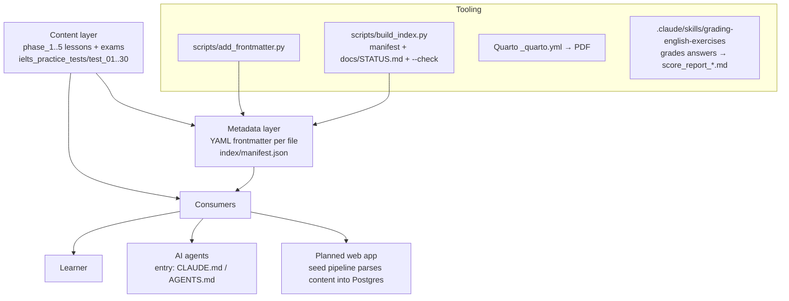

# Architecture

This is a **content repository** (bilingual English curriculum), not an
application codebase. A Next.js web app that consumes this content is planned
but not yet built — see `docs/superpowers/plans/2026-07-02-english-learning-web-app.md`
(and the original sketch in `docs/plans/architecture-sketch.md` /
`docs/plans/plan_build_web.md`).

## Layers

## Key decisions

- **Markdown is the single source of truth.** The planned web app's seed
  pipeline parses these files; it never edits them. Answer keys stay embedded
  in `exercise.md` (lessons) or separate `answer_key.md` (exams/IELTS).
- **Metadata is generated, not hand-maintained.** `scripts/build_index.py`
  rebuilds `index/manifest.json` and `docs/STATUS.md` from the tree;
  `--check` fails CI-style if they drift. The previous hand-written STATUS.md
  went stale exactly because it was manual.
- **Frontmatter is additive.** Content below the `---` block is byte-identical
  to the pre-frontmatter version; Quarto uses `title:`, agents use the rest.
- **Planned web stack** (from the web-app plan): Next.js 15 + Prisma + Neon
  Postgres on Vercel, all app code under `web/` (does not exist yet); repo
  root stays a content repo.

## Repository map

| Path | What it is |
|---|---|
| `phase_<N>_<name>/lesson_*/` | lessons: lecture + vocabulary + exercise |
| `phase_<N>_<name>/exam/` | end-of-phase exam + answer key |
| `ielts_practice_tests/test_<NN>/` | full IELTS tests (reading/writing/speaking/key) |
| `index/manifest.json` | generated inventory of everything above |
| `scripts/` | stdlib-Python tooling (see docs/data-flow.md) |
| `docs/` | this knowledge base + generated STATUS.md + WORKFLOW.md |
| `docs/plans/` | historical planning docs (frozen) |
| `docs/superpowers/plans/` | executable implementation plans |
| `.claude/skills/grading-english-exercises/` | grading skill (rubric + templates) |
| `_quarto.yml` | Quarto project: renders `**/*.md` to PDF |
