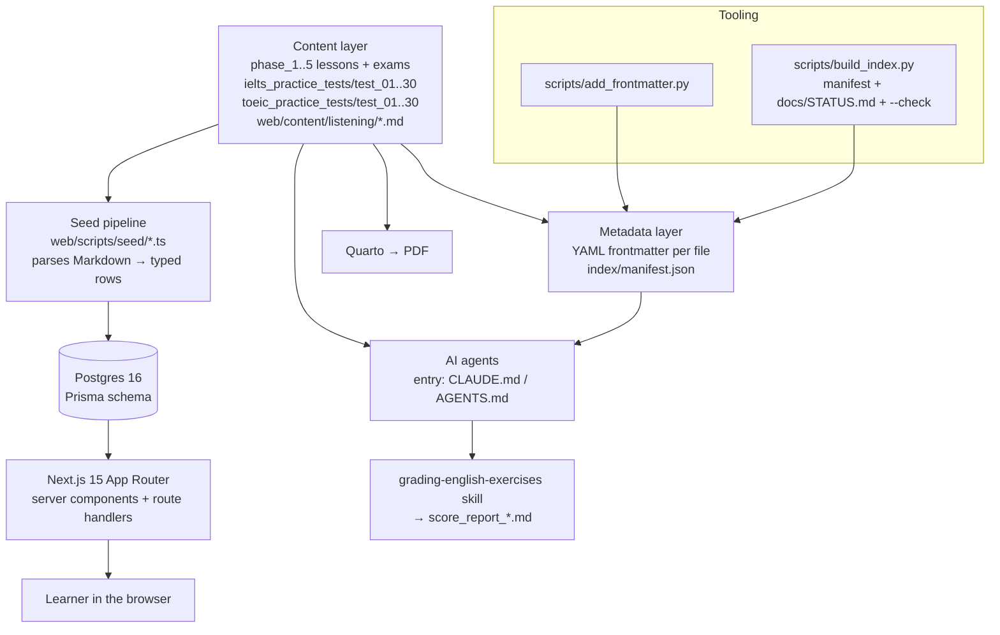

# Architecture

Two things live in this repo, and the boundary between them is the most
important fact here:

1. **A content repository** — the bilingual English curriculum, authored as
   Markdown (`phase_1..5_*/`, `ielts_practice_tests/`, `toeic_practice_tests/`).
   This is the **single source of truth**.
2. **A Next.js web app** under `web/` — it *reads* that content through a seed
   pipeline into Postgres and serves it to learners. It never writes back to
   the Markdown.

Content can be studied, graded, and rendered to PDF with no app running at all
(that path is agent- and Quarto-driven). The app is a consumer, not the owner.

## Layers

## The app

**Stack:** Next.js 15 (App Router, Turbopack) · React 19 · TypeScript ·
Tailwind v4 + shadcn/Base UI · Prisma 6 → Postgres 16 · NextAuth v5
(Google OAuth) · Vitest 4. All of it under `web/`; npm; tests co-located next
to the code they cover.

**Runtime:** self-hosted Docker Compose (`docker-compose.yml` at the repo root)
— `db` (postgres:16-alpine), `web` (built from `web/Dockerfile`, build context =
repo root, because the seed scripts need the curriculum tree one level above
`web/`), and `cloudflare` (cloudflared tunnel, so the host exposes no public
ingress). The `Makefile` is the operator interface: `make bootstrap` / `up` /
`migrate` / `seed-all` / `dbsh`.

**Persistence:** all learner state lives in the named volume
`learning_english_db_data` (the `db_data` volume of the `learning_english`
compose project) — users, placement results, exercise attempts, vocab Leitner
boxes. Content rows are disposable (re-seedable from Markdown); **these are
not.** Repointing the `db` volume in `docker-compose.yml` silently starts
Postgres on an empty data directory, so treat that line as load-bearing: change
it only together with a data migration.

**Test stack:** `docker-compose.test.yml` is a *second* compose project
(`learning-english-test`) that runs alongside prod — web on 3100, Postgres on
5433, Postgres data on `tmpfs` (ephemeral), and no `cloudflare` service, so a
build under test never reaches the Internet. It reuses `web/Dockerfile`: the
`web` service builds `target: runner` (byte-for-byte what prod ships), and a
one-shot `vitest` service builds `target: test`, a stage inheriting `builder`
so it carries the devDependencies. Driven by `make test-up` / `test-unit` /
`test-down` — see `docs/test-environment.md`.

> An earlier plan targeted Vercel + Neon. That is **not** what got built — the
> deployment is self-hosted behind a Cloudflare tunnel.

**Routes** (`web/src/app/`):

| Group | Routes | Notes |
|---|---|---|
| `(auth)` | `/login` | Google OAuth only; no passwords. |
| `onboarding/` | `/onboarding/name`, `/path`, `/placement`, `/placement/result` | Runs outside the app shell; sets name, goal, placement band. |
| `(app)` | `/dashboard`, `/learn/[phase]/[lesson]` (+ `/exercise`, `/vocab/{flashcards,match,quiz}`), `/listening`, `/listening/[slug]`, `/ielts`, `/ielts/[n]`, `/vocab`, `/settings` | Authenticated shell (sidebar + header). |
| `api/` | `attempts/[id]/answers`, `exercises/[id]/attempts`, `listening/[slug]/check`, `placement/*`, `onboarding/path`, `profile/name`, `vocab/review`, `auth/[...nextauth]` | Route handlers; all grading happens here, server-side. |

`web/src/middleware.ts` (edge runtime) gates `/dashboard`, `/learn`, `/ielts`,
`/listening`, `/settings`, `/onboarding`. It imports only `lib/auth/auth.config.ts`,
which is deliberately Prisma-free so it can run on the edge.

**Domain logic lives in `web/src/lib/`, not in components:** `grading/`
(normalize → match → sentence diffing / error spans), `band.ts` and `toeic.ts`
(raw → IELTS band / TOEIC scaled score), `progress.ts`, `vocab.ts` (Leitner
boxes), `placement*.ts`, `ielts-*.ts`, `transcript.ts`. These are pure functions
with their own unit tests — which is why the suite is fast and mostly runs in
the `node` environment (UI tests opt into jsdom per file with a
`// @vitest-environment jsdom` pragma).

## Key decisions

- **Markdown is the single source of truth.** `web/scripts/seed/ingest.ts` (and
  `seed-placement.ts` / `seed-ielts.ts`) parse content into Postgres, idempotent
  via a `contentHash` per lesson; they never edit the Markdown. Changing content
  means editing the `.md` and re-seeding.
- **Answer keys never reach the browser.** They are parsed into `Question` /
  `AnswerVariant` rows; grading runs in route handlers against the DB and only
  the verdict comes back.
- **Metadata is generated, not hand-maintained.** `scripts/build_index.py`
  rebuilds `index/manifest.json` + `docs/STATUS.md` from the tree; `--check`
  fails on drift. The old hand-written STATUS.md went stale precisely because it
  was manual.
- **Frontmatter is additive.** Content below the `---` block is byte-identical
  to the pre-frontmatter version; Quarto uses `title:`, agents use the rest.
- **Two grading paths, deliberately.** In-app grading is deterministic code in
  `lib/grading/` for exercises with keys; agent grading is the
  `grading-english-exercises` skill, for free-form writing/speaking and for
  learners working straight from the Markdown. They share no code and don't need
  to.
- **AI is stubbed, not absent.** `lib/ai/grader.ts` defines an `Explainer`
  interface whose only implementation is `NullExplainer`. The wrong-answer path
  already awaits it and stores whatever it returns, so an LLM-backed explainer
  can be swapped in with no call-site changes.
- **Audio is pre-generated, not synthesized per request.**
  `web/scripts/tts/generate_audio.py` writes files into `web/public/audio/`;
  listening sets and sections reference them by URL.

## Repository map

| Path | What it is |
|---|---|
| `phase_<N>_<name>/lesson_*/` | lessons: lecture + vocabulary + exercise (key embedded) |
| `phase_<N>_<name>/exam/` | end-of-phase exam + answer key |
| `ielts_practice_tests/test_<NN>/` | full IELTS tests (reading/writing/speaking/key) |
| `toeic_practice_tests/test_<NN>/` | TOEIC tests (listening placeholder/reading/speaking/writing/key) |
| `index/manifest.json` | generated inventory of all of the above |
| `web/src/app/` | routes: `(auth)`, `onboarding/`, `(app)`, `api/` |
| `web/src/lib/` | domain logic (grading, banding, progress, vocab) — unit-tested |
| `web/src/components/` | UI: app shell (`AppSidebar`, `AppHeader`), runners (`ExerciseRunner`, `SectionedListeningRunner`, `ExerciseReview`, `runner/`), `vocab/` (games), `ui/` (shadcn primitives) |
| `web/prisma/` | `schema.prisma` + `migrations/` |
| `web/scripts/seed/` | Markdown → Postgres ingest + parsers (+ their tests) |
| `web/scripts/tts/` | Python TTS → `web/public/audio/` |
| `web/content/listening/` | listening-set sources (app-only content, not curriculum) |
| `docker-compose.yml`, `Makefile`, `web/Dockerfile` | self-hosted runtime |
| `scripts/` | stdlib-Python curriculum tooling (see docs/data-flow.md) |
| `docs/design/` | design-system exports — read before any UI work |
| `docs/plans/` | historical planning docs (frozen) |
| `docs/superpowers/plans/` | executable implementation plans |
| `.claude/skills/grading-english-exercises/` | grading skill (rubric + templates) |
| `_quarto.yml` | Quarto project: renders `**/*.md` to PDF |
