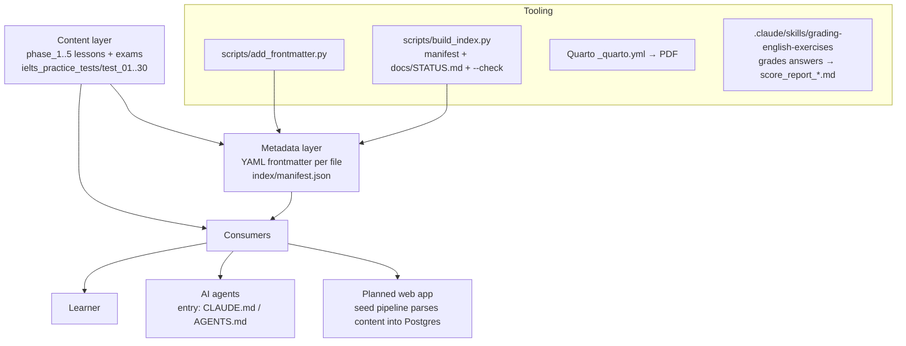

# AI-Agent-Friendly Repository Implementation Plan

> **For agentic workers:** REQUIRED SUB-SKILL: Use superpowers:subagent-driven-development (recommended) or superpowers:executing-plans to implement this plan task-by-task. Steps use checkbox (`- [ ]`) syntax for tracking.
>
> **On execution start:** copy this plan into the repo at `docs/superpowers/plans/2026-07-04-agent-friendly-repo.md` (repo-visible plan file, matching the existing convention in `docs/superpowers/plans/`).

**Goal:** Make this Markdown English-curriculum repository machine-navigable: a generated manifest + per-file YAML frontmatter for precise retrieval, a stdlib-Python index/validation toolchain that prevents drift, a `docs/` knowledge base (architecture, content model, data flow), and root `CLAUDE.md`/`AGENTS.md`/`README.md` entry points.

**Architecture:** Three layers. (1) **Metadata**: every content file under `phase_*/` and `ielts_practice_tests/` gets YAML frontmatter (type, phase/test, topic, CEFR, title) injected by an idempotent script; a generated `index/manifest.json` gives whole-repo discovery in one read. (2) **Tooling**: `scripts/curriculum_lib.py` (shared scanner) + `scripts/add_frontmatter.py` + `scripts/build_index.py` (writes manifest + regenerated `docs/STATUS.md`; `--check` mode exits 1 on drift/missing frontmatter). (3) **Docs**: root `CLAUDE.md` (canonical agent entry point, `AGENTS.md` symlinks to it) pointing into `docs/` reference docs. Historical planning files move from root into `docs/plans/`.

**Tech Stack:** Python 3.12 stdlib only (no pip installs), `unittest` for tests, Markdown + YAML frontmatter, existing Quarto 1.6 PDF pipeline untouched.

## Global Constraints

- **Curriculum content is read-only except for the one-time frontmatter prepend.** Never alter headings, question numbering, or answer keys — the grading skill (`.claude/skills/grading-english-exercises/SKILL.md`) greps `## ANSWER KEY` and the web-app seed plan parses these files.
- **Python stdlib only** — no `pip install`, no `requirements.txt`. Verified: Python 3.12.3 on PATH as `python3`.
- **Agent-facing docs in English** (user's choice). Learner-facing curriculum content stays bilingual (Vietnamese headings / English examples) — do not translate it.
- **Frontmatter must be idempotent and Quarto-safe**: skip files already starting with `---`; string values emitted via `json.dumps` (valid YAML scalars); `title:` is a real Quarto field, extra fields are passed through harmlessly.
- **`git mv` for tracked files** (preserves history); plain `mv` + `git add` only for the untracked ones (`architecture.md`, `architecture.drawio`, `plan_build_web.md` are untracked per git status).
- **Validator severity policy:** *errors* (exit 1) = structural problems agents must fix (missing frontmatter, stale manifest); *warnings* (exit 0) = curriculum completeness gaps (missing `vocabulary.md`, missing answer-key heading) — those are status, not build failures.
- **Do not touch** `.worktrees/`, `.quarto/`, `.git/`, `.claude/` (except no changes needed there), or the two locally-deleted PDFs in `ielts_practice_tests/test_01/` (learner's own working-tree change — leave staged state alone).
- Work on the current branch `tdb`; commit after every task.

## Context

The repo is a bilingual English curriculum (~290 content Markdown files, no application code): 5 phases (`phase_1_foundation` … `phase_5_ielts_prep`, 52 lessons, each lesson dir = `lecture.md` + `vocabulary.md` + `exercise.md` with embedded `## ANSWER KEY (ĐÁP ÁN)`), per-phase `exam/` dirs (`phaseN_exam.md` + `phaseN_answer_key.md`), and 30 complete IELTS practice tests (`test_01`–`test_30`, each `reading.md`/`writing.md`/`speaking.md`/`answer_key.md`). A Claude skill grades submissions and writes `score_report_<date>.md` files into lesson dirs. A Next.js web app is planned (865-line plan at `docs/superpowers/plans/2026-07-02-english-learning-web-app.md`) whose seed pipeline will parse these same files.

**Problems this plan fixes:** `README.md` is a one-line stub; there is no `CLAUDE.md`/`AGENTS.md`; 9+ planning/status files clutter the root; `STATUS.md` is badly stale (claims tests 12–14/16/20/23–50 don't exist — all 30 exist and are complete; also contains a wrong root path `/home/ncd/workspace/...`); content files carry zero metadata, so agents must crawl and read files to discover anything; the only "architecture" doc is a 5-line stub. Known real gap the tooling must surface, not hide: `phase_1_foundation/lesson_13_question_tags/` has no `vocabulary.md`.

User decisions (clarified 2026-07-04): manifest **and** frontmatter; yes to a validation/index script; agent docs in English; move loose root files into `docs/`.

## File Structure

```
learning_english/
  CLAUDE.md                     # NEW — canonical agent entry point
  AGENTS.md                     # NEW — symlink → CLAUDE.md
  README.md                     # REWRITTEN — human-facing overview
  _quarto.yml                   # untouched
  index/
    manifest.json               # GENERATED — full curriculum inventory
  scripts/
    curriculum_lib.py           # NEW — shared scanner/classifier (stdlib)
    add_frontmatter.py          # NEW — one-time idempotent frontmatter injector
    build_index.py              # NEW — writes manifest + docs/STATUS.md; --check validates
    tests/
      test_curriculum_tools.py  # NEW — unittest suite w/ tmp fixture tree
  docs/
    STATUS.md                   # MOVED from root, then REGENERATED by build_index.py
    WORKFLOW.md                 # MOVED from root (user's personal workflow, unchanged)
    architecture.md             # NEW — real architecture doc (absorbs the 5-line stub)
    content-model.md            # NEW — file-format specs ("API" of the content)
    data-flow.md                # NEW — authoring/grading/tooling/web-seed flows
    plans/                      # NEW dir — historical planning artifacts, unchanged content
      plan.md  plan_v2.md  plan_change.md  plan_v3_scoring_skill.md
      plan_build_web.md  plan.pdf  README.pdf
      architecture-sketch.md    # renamed from root architecture.md (5-line stub)
      architecture.drawio  polymorphic-scribbling-journal.md
    superpowers/plans/          # existing, unchanged
  phase_*/  ielts_practice_tests/   # content — frontmatter prepended, nothing else
```

---

### Task 1: Root cleanup — move planning files into `docs/`

**Files:**
- Create dir: `docs/plans/`
- Move (tracked, via `git mv`): `plan.md`, `plan_v2.md`, `plan_change.md`, `plan_v3_scoring_skill.md`, `plan.pdf`, `README.pdf`, `polymorphic-scribbling-journal.md` → `docs/plans/`; `STATUS.md`, `WORKFLOW.md` → `docs/`
- Move (untracked, via `mv` + `git add`): `plan_build_web.md`, `architecture.drawio` → `docs/plans/`; `architecture.md` → `docs/plans/architecture-sketch.md`

**Interfaces:**
- Consumes: nothing.
- Produces: root containing only `README.md`, `_quarto.yml`, `.gitignore`, content dirs, and (later) `CLAUDE.md`/`AGENTS.md`/`index/`/`scripts/`. Later tasks reference `docs/STATUS.md` and `docs/plans/plan_build_web.md` at these exact paths.

- [ ] **Step 1: Verify current state matches expectations**

Run: `cd /home/ncd/learnspaces/learning_english && git status --porcelain -- plan.md plan_v2.md plan_change.md plan_v3_scoring_skill.md plan.pdf README.pdf polymorphic-scribbling-journal.md STATUS.md WORKFLOW.md architecture.md architecture.drawio plan_build_web.md`
Expected: `architecture.md`, `architecture.drawio`, `plan_build_web.md` show `??` (untracked); the rest show nothing (clean/tracked). If anything differs, stop and re-check before moving.

- [ ] **Step 2: Move the files**

```bash
cd /home/ncd/learnspaces/learning_english
mkdir -p docs/plans
git mv plan.md plan_v2.md plan_change.md plan_v3_scoring_skill.md plan.pdf README.pdf polymorphic-scribbling-journal.md docs/plans/
git mv STATUS.md WORKFLOW.md docs/
mv plan_build_web.md architecture.drawio docs/plans/
mv architecture.md docs/plans/architecture-sketch.md
git add docs/plans/plan_build_web.md docs/plans/architecture.drawio docs/plans/architecture-sketch.md
```

- [ ] **Step 3: Verify nothing was lost**

Run: `ls docs/plans/ docs/ && git status --porcelain | head -30`
Expected: `docs/plans/` contains 10 files (`plan.md`, `plan_v2.md`, `plan_change.md`, `plan_v3_scoring_skill.md`, `plan.pdf`, `README.pdf`, `polymorphic-scribbling-journal.md`, `plan_build_web.md`, `architecture.drawio`, `architecture-sketch.md`); `docs/` contains `STATUS.md`, `WORKFLOW.md`, `plans/`, `superpowers/`. Git status shows renames (`R`) and adds (`A`), no deletions without a matching destination.

- [ ] **Step 4: Commit**

```bash
git commit -m "chore: move planning/status docs from root into docs/ and docs/plans/"
```

---

### Task 2: Shared scanner library `scripts/curriculum_lib.py`

**Files:**
- Create: `scripts/curriculum_lib.py`
- Test: `scripts/tests/test_curriculum_tools.py` (fixture + `ScanTests` class; later tasks append more classes to this same file)

**Interfaces:**
- Consumes: repository directory layout only.
- Produces (used by Tasks 3, 4 and their tests):
  - `PHASE_CEFR: dict[int, str]` — `{1:"A1-A2", 2:"A2-B1", 3:"B1-B2", 4:"B2-C1", 5:"C1"}`
  - `LESSON_FILES: tuple[str, ...]` = `("lecture.md","vocabulary.md","exercise.md")`; `IELTS_FILES` = `("reading.md","writing.md","speaking.md","answer_key.md")`
  - `read_title(path: Path) -> str` — first `# ` heading, else file stem
  - `has_frontmatter(text: str) -> bool`
  - `classify(rel_path: Path) -> dict | None` — metadata dict (`id`, `type`, `cefr`, plus `phase`/`lesson`/`topic` or `test`) for one content file; `None` for non-content paths
  - `scan_repo(root: Path) -> dict` — `{"phases": [...], "ielts_tests": [...]}` (exact shape in code below)

- [ ] **Step 1: Write the failing test**

Create `scripts/tests/test_curriculum_tools.py`:

```python
"""Tests for the curriculum tooling. Run from repo root:
python3 -m unittest discover -s scripts/tests -v
"""
import json
import shutil
import subprocess
import sys
import tempfile
import unittest
from pathlib import Path

SCRIPTS = Path(__file__).resolve().parents[1]
sys.path.insert(0, str(SCRIPTS))
import curriculum_lib as lib  # noqa: E402


def make_fixture(root: Path) -> None:
    """Miniature curriculum: 1 complete lesson, 1 exam, 1 incomplete IELTS test."""
    les = root / "phase_1_foundation" / "lesson_01_simple_present"
    les.mkdir(parents=True)
    (les / "lecture.md").write_text(
        "# BÀI 1: THÌ HIỆN TẠI ĐƠN (SIMPLE PRESENT TENSE)\n\nnội dung\n",
        encoding="utf-8")
    (les / "vocabulary.md").write_text("# VOCABULARY - BÀI 1\n\n| Word |\n", encoding="utf-8")
    (les / "exercise.md").write_text(
        "# EXERCISE - BÀI 1\n\n## SECTION A\n\n1. ...\n\n## ANSWER KEY (ĐÁP ÁN)\n\n1. cooks\n",
        encoding="utf-8")
    exam = root / "phase_1_foundation" / "exam"
    exam.mkdir()
    (exam / "phase1_exam.md").write_text("# KIỂM TRA CUỐI GIAI ĐOẠN 1\n", encoding="utf-8")
    (exam / "phase1_answer_key.md").write_text("# ĐÁP ÁN PHASE 1\n", encoding="utf-8")
    test = root / "ielts_practice_tests" / "test_01"
    test.mkdir(parents=True)
    for name in ("reading.md", "writing.md", "speaking.md"):
        (test / name).write_text(f"# IELTS {name}\n", encoding="utf-8")
    # answer_key.md deliberately missing -> incomplete test


class ScanTests(unittest.TestCase):
    def setUp(self):
        self.tmp = Path(tempfile.mkdtemp())
        make_fixture(self.tmp)

    def tearDown(self):
        shutil.rmtree(self.tmp)

    def test_classify_lesson_and_ielts_files(self):
        meta = lib.classify(Path("phase_1_foundation/lesson_01_simple_present/lecture.md"))
        self.assertEqual(meta["type"], "lecture")
        self.assertEqual(meta["phase"], 1)
        self.assertEqual(meta["topic"], "simple present")
        self.assertEqual(meta["cefr"], "A1-A2")
        meta = lib.classify(Path("phase_1_foundation/exam/phase1_answer_key.md"))
        self.assertEqual(meta["type"], "phase_exam_answer_key")
        meta = lib.classify(Path("ielts_practice_tests/test_01/reading.md"))
        self.assertEqual(meta["type"], "ielts_reading")
        self.assertEqual(meta["test"], 1)
        self.assertIsNone(lib.classify(Path("docs/STATUS.md")))
        self.assertIsNone(lib.classify(Path("README.md")))

    def test_scan_finds_lesson_and_flags_incomplete_test(self):
        data = lib.scan_repo(self.tmp)
        self.assertEqual(len(data["phases"]), 1)
        phase = data["phases"][0]
        self.assertEqual(phase["number"], 1)
        self.assertEqual(phase["cefr"], "A1-A2")
        lesson = phase["lessons"][0]
        self.assertTrue(lesson["complete"])
        self.assertEqual(lesson["topic"], "simple present")
        self.assertEqual(lesson["title"], "BÀI 1: THÌ HIỆN TẠI ĐƠN (SIMPLE PRESENT TENSE)")
        self.assertTrue(phase["exam"]["exam"])
        self.assertTrue(phase["exam"]["answer_key"])
        self.assertEqual(len(data["ielts_tests"]), 1)
        self.assertFalse(data["ielts_tests"][0]["complete"])
        self.assertFalse(data["ielts_tests"][0]["files"]["answer_key.md"])


if __name__ == "__main__":
    unittest.main()
```

- [ ] **Step 2: Run test to verify it fails**

Run: `cd /home/ncd/learnspaces/learning_english && python3 -m unittest discover -s scripts/tests -v`
Expected: FAIL with `ModuleNotFoundError: No module named 'curriculum_lib'`.

- [ ] **Step 3: Write the implementation**

Create `scripts/curriculum_lib.py`:

```python
"""Shared helpers for curriculum tooling. Python stdlib only.

Understands the repo layout:
  phase_<N>_<name>/lesson_<NN>_<slug>/{lecture,vocabulary,exercise}.md
  phase_<N>_<name>/exam/phase<N>_{exam,answer_key}.md
  ielts_practice_tests/test_<NN>/{reading,writing,speaking,answer_key}.md
plus score_report_*.md and feedback.md files that may sit in any of those dirs.
"""
from __future__ import annotations

import re
from pathlib import Path

PHASE_CEFR = {1: "A1-A2", 2: "A2-B1", 3: "B1-B2", 4: "B2-C1", 5: "C1"}

PHASE_DIR_RE = re.compile(r"^phase_(\d)_([a-z_]+)$")
LESSON_DIR_RE = re.compile(r"^lesson_(\d{2})_([a-z0-9_]+)$")
TEST_DIR_RE = re.compile(r"^test_(\d{2})$")

LESSON_FILES = ("lecture.md", "vocabulary.md", "exercise.md")
IELTS_FILES = ("reading.md", "writing.md", "speaking.md", "answer_key.md")


def read_title(path: Path) -> str:
    """First '# ' heading in the file, else the file stem."""
    try:
        for line in path.read_text(encoding="utf-8").splitlines():
            if line.startswith("# "):
                return line[2:].strip()
    except FileNotFoundError:
        pass
    return path.stem


def has_frontmatter(text: str) -> bool:
    return text.startswith("---\n") or text.startswith("---\r\n")


def classify(rel_path: Path) -> dict | None:
    """Metadata for one content file (repo-relative path), or None."""
    parts = rel_path.parts
    if len(parts) != 3 or not parts[2].endswith(".md"):
        return None
    top, sub, name = parts
    meta = {"id": str(rel_path)[: -len(".md")]}

    pm = PHASE_DIR_RE.match(top)
    if pm:
        phase = int(pm.group(1))
        meta["phase"] = phase
        meta["cefr"] = PHASE_CEFR.get(phase, "")
        lm = LESSON_DIR_RE.match(sub)
        if lm:
            meta["lesson"] = sub
            meta["topic"] = lm.group(2).replace("_", " ")
            if name in LESSON_FILES:
                meta["type"] = name[: -len(".md")]
            elif name.startswith("score_report"):
                meta["type"] = "score_report"
            elif name == "feedback.md":
                meta["type"] = "feedback"
            else:
                meta["type"] = "lesson_extra"
            return meta
        if sub == "exam":
            if name.endswith("_answer_key.md"):
                meta["type"] = "phase_exam_answer_key"
            elif name.endswith("_exam.md"):
                meta["type"] = "phase_exam"
            elif name.startswith("score_report"):
                meta["type"] = "score_report"
            else:
                meta["type"] = "exam_extra"
            return meta
        return None

    if top == "ielts_practice_tests":
        tm = TEST_DIR_RE.match(sub)
        if not tm:
            return None
        meta["test"] = int(tm.group(1))
        meta["cefr"] = "C1"
        if name in IELTS_FILES:
            meta["type"] = "ielts_" + name[: -len(".md")]
        elif name.startswith("score_report"):
            meta["type"] = "score_report"
        else:
            meta["type"] = "ielts_extra"
        return meta

    return None


def scan_repo(root: Path) -> dict:
    """Inventory of phases/lessons/exams and IELTS tests with completeness flags."""
    phases = []
    for pdir in sorted(root.glob("phase_*")):
        pm = PHASE_DIR_RE.match(pdir.name)
        if not (pdir.is_dir() and pm):
            continue
        num = int(pm.group(1))
        lessons = []
        for ldir in sorted(pdir.glob("lesson_*")):
            lm = LESSON_DIR_RE.match(ldir.name)
            if not (ldir.is_dir() and lm):
                continue
            present = {f: (ldir / f).is_file() for f in LESSON_FILES}
            lecture = ldir / "lecture.md"
            lessons.append({
                "dir": f"{pdir.name}/{ldir.name}",
                "number": int(lm.group(1)),
                "topic": lm.group(2).replace("_", " "),
                "title": read_title(lecture) if lecture.is_file() else ldir.name,
                "files": present,
                "complete": all(present.values()),
                "score_reports": sorted(p.name for p in ldir.glob("score_report_*.md")),
            })
        exam = None
        exam_dir = pdir / "exam"
        if exam_dir.is_dir():
            exam = {
                "dir": f"{pdir.name}/exam",
                "exam": (exam_dir / f"phase{num}_exam.md").is_file(),
                "answer_key": (exam_dir / f"phase{num}_answer_key.md").is_file(),
            }
        phases.append({
            "dir": pdir.name,
            "number": num,
            "name": pm.group(2),
            "cefr": PHASE_CEFR.get(num, ""),
            "lessons": lessons,
            "exam": exam,
        })

    tests = []
    tests_root = root / "ielts_practice_tests"
    if tests_root.is_dir():
        for tdir in sorted(tests_root.glob("test_*")):
            tm = TEST_DIR_RE.match(tdir.name)
            if not (tdir.is_dir() and tm):
                continue
            present = {f: (tdir / f).is_file() for f in IELTS_FILES}
            tests.append({
                "dir": f"ielts_practice_tests/{tdir.name}",
                "number": int(tm.group(1)),
                "files": present,
                "complete": all(present.values()),
                "score_reports": sorted(p.name for p in tdir.glob("score_report_*.md")),
            })

    return {"phases": phases, "ielts_tests": tests}
```

- [ ] **Step 4: Run tests to verify they pass**

Run: `python3 -m unittest discover -s scripts/tests -v`
Expected: `test_classify_lesson_and_ielts_files ... ok`, `test_scan_finds_lesson_and_flags_incomplete_test ... ok` — 2 tests, OK.

- [ ] **Step 5: Commit**

```bash
git add scripts/curriculum_lib.py scripts/tests/test_curriculum_tools.py
git commit -m "feat: add curriculum scanner library with tests (stdlib only)"
```

---

### Task 3: Frontmatter injector `scripts/add_frontmatter.py`

**Files:**
- Create: `scripts/add_frontmatter.py`
- Test: append `FrontmatterTests` class to `scripts/tests/test_curriculum_tools.py`

**Interfaces:**
- Consumes: `classify`, `has_frontmatter`, `read_title` from `curriculum_lib`.
- Produces: CLI `python3 scripts/add_frontmatter.py [--root DIR] [--dry-run]`. Prepends a YAML block to every content file that lacks one. Frontmatter keys (exact): `id`, `type`, `phase`|`test`, `lesson` (lesson files only), `topic` (lesson files only), `cefr`, `title`, `lang: vi-en`. Task 4's validator errors on content files missing frontmatter — this script is what satisfies it.

- [ ] **Step 1: Write the failing test**

Append to `scripts/tests/test_curriculum_tools.py` (before the `if __name__ == "__main__":` line):

```python
class FrontmatterTests(unittest.TestCase):
    def setUp(self):
        self.tmp = Path(tempfile.mkdtemp())
        make_fixture(self.tmp)

    def tearDown(self):
        shutil.rmtree(self.tmp)

    def run_script(self, name, *args):
        return subprocess.run(
            [sys.executable, str(SCRIPTS / name), "--root", str(self.tmp), *args],
            capture_output=True, text=True)

    def test_adds_frontmatter_and_is_idempotent(self):
        result = self.run_script("add_frontmatter.py")
        self.assertEqual(result.returncode, 0, result.stderr)
        lecture = self.tmp / "phase_1_foundation/lesson_01_simple_present/lecture.md"
        text = lecture.read_text(encoding="utf-8")
        self.assertTrue(text.startswith("---\n"))
        self.assertIn("type: lecture", text)
        self.assertIn("phase: 1", text)
        self.assertIn("cefr: A1-A2", text)
        self.assertIn('topic: "simple present"', text)
        # original first heading is preserved right after the frontmatter block
        self.assertIn("# BÀI 1: THÌ HIỆN TẠI ĐƠN", text)
        reading = (self.tmp / "ielts_practice_tests/test_01/reading.md").read_text(encoding="utf-8")
        self.assertIn("type: ielts_reading", reading)
        self.assertIn("test: 1", reading)
        # second run changes nothing
        before = text
        result2 = self.run_script("add_frontmatter.py")
        self.assertEqual(result2.returncode, 0, result2.stderr)
        self.assertEqual(lecture.read_text(encoding="utf-8"), before)

    def test_dry_run_writes_nothing(self):
        lecture = self.tmp / "phase_1_foundation/lesson_01_simple_present/lecture.md"
        before = lecture.read_text(encoding="utf-8")
        result = self.run_script("add_frontmatter.py", "--dry-run")
        self.assertEqual(result.returncode, 0, result.stderr)
        self.assertEqual(lecture.read_text(encoding="utf-8"), before)
```

- [ ] **Step 2: Run test to verify it fails**

Run: `python3 -m unittest discover -s scripts/tests -v`
Expected: the two new `FrontmatterTests` FAIL (script file does not exist → `returncode != 0`); the two `ScanTests` still pass.

- [ ] **Step 3: Write the implementation**

Create `scripts/add_frontmatter.py`:

```python
#!/usr/bin/env python3
"""Prepend YAML frontmatter to curriculum content files. Idempotent:
files already starting with '---' are skipped. Stdlib only.

Usage: python3 scripts/add_frontmatter.py [--root DIR] [--dry-run]
"""
from __future__ import annotations

import argparse
import json
import sys
from pathlib import Path

sys.path.insert(0, str(Path(__file__).resolve().parent))
from curriculum_lib import classify, has_frontmatter, read_title  # noqa: E402

CONTENT_GLOBS = ("phase_*/*/*.md", "ielts_practice_tests/test_*/*.md")


def frontmatter_for(root: Path, rel: Path) -> str | None:
    meta = classify(rel)
    if meta is None:
        return None
    title = read_title(root / rel)
    lines = ["---",
             f"id: {json.dumps(meta['id'])}",
             f"type: {meta['type']}"]
    if "phase" in meta:
        lines.append(f"phase: {meta['phase']}")
    if "test" in meta:
        lines.append(f"test: {meta['test']}")
    if "lesson" in meta:
        lines.append(f"lesson: {meta['lesson']}")
    if "topic" in meta:
        lines.append(f"topic: {json.dumps(meta['topic'])}")
    lines += [f"cefr: {meta['cefr']}",
              f"title: {json.dumps(title, ensure_ascii=False)}",
              "lang: vi-en",
              "---"]
    return "\n".join(lines) + "\n\n"


def main() -> int:
    parser = argparse.ArgumentParser(description=__doc__)
    parser.add_argument("--root", default=".")
    parser.add_argument("--dry-run", action="store_true")
    args = parser.parse_args()
    root = Path(args.root).resolve()

    changed = skipped = 0
    for pattern in CONTENT_GLOBS:
        for path in sorted(root.glob(pattern)):
            rel = path.relative_to(root)
            text = path.read_text(encoding="utf-8")
            if has_frontmatter(text):
                skipped += 1
                continue
            block = frontmatter_for(root, rel)
            if block is None:
                continue
            if not args.dry_run:
                path.write_text(block + text, encoding="utf-8")
            changed += 1
            print(f"add: {rel}")
    mode = "would update" if args.dry_run else "updated"
    print(f"{mode} {changed} files, {skipped} already had frontmatter")
    return 0


if __name__ == "__main__":
    sys.exit(main())
```

- [ ] **Step 4: Run tests to verify they pass**

Run: `python3 -m unittest discover -s scripts/tests -v`
Expected: 4 tests, OK.

- [ ] **Step 5: Commit**

```bash
git add scripts/add_frontmatter.py scripts/tests/test_curriculum_tools.py
git commit -m "feat: add idempotent YAML-frontmatter injector for content files"
```

---

### Task 4: Index generator + validator `scripts/build_index.py`

**Files:**
- Create: `scripts/build_index.py`
- Test: append `BuildIndexTests` class to `scripts/tests/test_curriculum_tools.py`

**Interfaces:**
- Consumes: `scan_repo`, `classify`, `has_frontmatter` from `curriculum_lib`.
- Produces: CLI `python3 scripts/build_index.py [--root DIR] [--check]`.
  - Default mode: writes `index/manifest.json` (scan_repo output + `"generated_at"` date) and `docs/STATUS.md` (generated status tables). Exits 1 only on *errors*.
  - `--check` mode: writes nothing; exits 1 if any content file lacks frontmatter OR `index/manifest.json` differs from a fresh scan (stale). Completeness gaps print as `WARN:` and do not fail.
  - CLAUDE.md (Task 6) documents both invocations verbatim.

- [ ] **Step 1: Write the failing test**

Append to `scripts/tests/test_curriculum_tools.py` (before `if __name__ == "__main__":`):

```python
class BuildIndexTests(unittest.TestCase):
    def setUp(self):
        self.tmp = Path(tempfile.mkdtemp())
        make_fixture(self.tmp)

    def tearDown(self):
        shutil.rmtree(self.tmp)

    def run_script(self, name, *args):
        return subprocess.run(
            [sys.executable, str(SCRIPTS / name), "--root", str(self.tmp), *args],
            capture_output=True, text=True)

    def test_generates_manifest_and_status(self):
        self.run_script("add_frontmatter.py")
        result = self.run_script("build_index.py")
        self.assertEqual(result.returncode, 0, result.stderr)
        manifest = json.loads((self.tmp / "index/manifest.json").read_text(encoding="utf-8"))
        self.assertIn("generated_at", manifest)
        self.assertEqual(len(manifest["phases"]), 1)
        self.assertFalse(manifest["ielts_tests"][0]["complete"])
        status = (self.tmp / "docs/STATUS.md").read_text(encoding="utf-8")
        self.assertIn("lesson_01_simple_present", status)
        self.assertIn("test_01", status)
        # incomplete IELTS test surfaces as a warning, not an error
        self.assertIn("WARN:", result.stdout)

    def test_check_passes_when_fresh_and_fails_on_drift(self):
        self.run_script("add_frontmatter.py")
        self.run_script("build_index.py")
        ok = self.run_script("build_index.py", "--check")
        self.assertEqual(ok.returncode, 0, ok.stdout + ok.stderr)
        # add a new lesson (no frontmatter, manifest now stale)
        new = self.tmp / "phase_1_foundation" / "lesson_02_present_continuous"
        new.mkdir()
        (new / "lecture.md").write_text("# BÀI 2\n", encoding="utf-8")
        bad = self.run_script("build_index.py", "--check")
        self.assertEqual(bad.returncode, 1)
        self.assertIn("missing frontmatter", bad.stderr)
        self.assertIn("stale", bad.stderr)
```

- [ ] **Step 2: Run test to verify it fails**

Run: `python3 -m unittest discover -s scripts/tests -v`
Expected: the two new `BuildIndexTests` FAIL (`build_index.py` not found); the 4 earlier tests still pass.

- [ ] **Step 3: Write the implementation**

Create `scripts/build_index.py`:

```python
#!/usr/bin/env python3
"""Generate index/manifest.json and docs/STATUS.md from the repo tree.

Usage:
  python3 scripts/build_index.py            # regenerate both files
  python3 scripts/build_index.py --check    # validate only; exit 1 on errors

Errors (exit 1): content file missing frontmatter; manifest stale (--check).
Warnings (exit 0): incomplete lessons/exams/IELTS tests; exercise.md without
an embedded '## ANSWER KEY' heading. Stdlib only.
"""
from __future__ import annotations

import argparse
import datetime
import json
import sys
from pathlib import Path

sys.path.insert(0, str(Path(__file__).resolve().parent))
from curriculum_lib import classify, has_frontmatter, scan_repo  # noqa: E402

CONTENT_GLOBS = ("phase_*/*/*.md", "ielts_practice_tests/test_*/*.md")


def validate(root: Path, data: dict) -> tuple[list[str], list[str]]:
    errors, warnings = [], []
    for pattern in CONTENT_GLOBS:
        for path in sorted(root.glob(pattern)):
            rel = path.relative_to(root)
            if classify(rel) is None:
                continue
            text = path.read_text(encoding="utf-8")
            if not has_frontmatter(text):
                errors.append(f"missing frontmatter: {rel}")
            if rel.name == "exercise.md" and "## ANSWER KEY" not in text:
                warnings.append(f"exercise without '## ANSWER KEY' heading: {rel}")
    for phase in data["phases"]:
        for lesson in phase["lessons"]:
            for fname, ok in lesson["files"].items():
                if not ok:
                    warnings.append(f"incomplete lesson: {lesson['dir']} missing {fname}")
        exam = phase["exam"]
        if exam:
            if not exam["exam"]:
                warnings.append(f"missing exam file in {exam['dir']}")
            if not exam["answer_key"]:
                warnings.append(f"missing answer key in {exam['dir']}")
    for test in data["ielts_tests"]:
        for fname, ok in test["files"].items():
            if not ok:
                warnings.append(f"incomplete IELTS test: {test['dir']} missing {fname}")
    return errors, warnings


def mark(ok: bool) -> str:
    return "✅" if ok else "❌ MISSING"


def render_status(data: dict) -> str:
    today = datetime.date.today().isoformat()
    out = [
        "# CURRICULUM STATUS",
        "",
        f"> Generated by `scripts/build_index.py` on {today}.",
        "> Do not edit by hand — run `python3 scripts/build_index.py` to refresh.",
        "",
    ]
    for phase in data["phases"]:
        done = sum(1 for l in phase["lessons"] if l["complete"])
        out += [
            f"## Phase {phase['number']} — {phase['name'].replace('_', ' ')} ({phase['cefr']})",
            "",
            f"{done}/{len(phase['lessons'])} lessons complete.",
            "",
            "| Lesson | lecture.md | vocabulary.md | exercise.md | Score reports |",
            "|---|:-:|:-:|:-:|---|",
        ]
        for lesson in phase["lessons"]:
            name = lesson["dir"].split("/", 1)[1]
            cells = [mark(lesson["files"][f]) for f in
                     ("lecture.md", "vocabulary.md", "exercise.md")]
            reports = ", ".join(lesson["score_reports"]) or "—"
            out.append(f"| {name} | {cells[0]} | {cells[1]} | {cells[2]} | {reports} |")
        exam = phase["exam"]
        if exam:
            out += ["", f"Exam: {mark(exam['exam'])} exam file, "
                        f"{mark(exam['answer_key'])} answer key ({exam['dir']})"]
        out.append("")
    complete = sum(1 for t in data["ielts_tests"] if t["complete"])
    out += [
        "## IELTS practice tests",
        "",
        f"{complete}/{len(data['ielts_tests'])} tests complete (4/4 files).",
        "",
        "| Test | reading | writing | speaking | answer key | Score reports |",
        "|---|:-:|:-:|:-:|:-:|---|",
    ]
    for test in data["ielts_tests"]:
        name = test["dir"].split("/", 1)[1]
        cells = [mark(test["files"][f]) for f in
                 ("reading.md", "writing.md", "speaking.md", "answer_key.md")]
        reports = ", ".join(test["score_reports"]) or "—"
        out.append(f"| {name} | {' | '.join(cells)} | {reports} |")
    out.append("")
    return "\n".join(out)


def main() -> int:
    parser = argparse.ArgumentParser(description=__doc__)
    parser.add_argument("--root", default=".")
    parser.add_argument("--check", action="store_true")
    args = parser.parse_args()
    root = Path(args.root).resolve()

    data = scan_repo(root)
    errors, warnings = validate(root, data)

    if args.check:
        manifest_path = root / "index" / "manifest.json"
        if manifest_path.is_file():
            stored = json.loads(manifest_path.read_text(encoding="utf-8"))
            stored.pop("generated_at", None)
            if stored != data:
                errors.append("index/manifest.json is stale — run: python3 scripts/build_index.py")
        else:
            errors.append("index/manifest.json does not exist — run: python3 scripts/build_index.py")
    else:
        manifest = dict(data)
        manifest["generated_at"] = datetime.date.today().isoformat()
        (root / "index").mkdir(exist_ok=True)
        (root / "index" / "manifest.json").write_text(
            json.dumps(manifest, ensure_ascii=False, indent=2) + "\n", encoding="utf-8")
        (root / "docs").mkdir(exist_ok=True)
        (root / "docs" / "STATUS.md").write_text(render_status(data), encoding="utf-8")
        print("wrote index/manifest.json and docs/STATUS.md")

    for warning in warnings:
        print(f"WARN: {warning}")
    for error in errors:
        print(f"ERROR: {error}", file=sys.stderr)
    print(f"{len(errors)} errors, {len(warnings)} warnings")
    return 1 if errors else 0


if __name__ == "__main__":
    sys.exit(main())
```

- [ ] **Step 4: Run tests to verify they pass**

Run: `python3 -m unittest discover -s scripts/tests -v`
Expected: 6 tests, OK.

- [ ] **Step 5: Commit**

```bash
git add scripts/build_index.py scripts/tests/test_curriculum_tools.py
git commit -m "feat: add manifest/STATUS generator with --check validation mode"
```

---

### Task 5: Run the tooling over the real repo

**Files:**
- Modify: all ~290 content `.md` files under `phase_*/` and `ielts_practice_tests/` (frontmatter prepend only)
- Create: `index/manifest.json`
- Modify: `docs/STATUS.md` (stale hand-written content replaced by generated content; old version stays in git history)

**Interfaces:**
- Consumes: the two scripts from Tasks 3–4.
- Produces: a frontmattered corpus + fresh manifest/status that Task 6's docs and Task 7's CLAUDE.md reference as existing facts.

- [ ] **Step 1: Dry-run first and sanity-check the count**

Run: `python3 scripts/add_frontmatter.py --dry-run | tail -3`
Expected: `would update N files, 0 already had frontmatter` where N ≈ 290 (52 lessons × 3 files − 1 missing vocabulary + 5×2 exam files + 30×4 IELTS files + score_report/feedback files). If N is wildly different (e.g. thousands — would mean `.worktrees/` leaked in), STOP and investigate before writing.

- [ ] **Step 2: Apply frontmatter for real**

Run: `python3 scripts/add_frontmatter.py | tail -3`
Expected: `updated N files, 0 already had frontmatter` with the same N.

- [ ] **Step 3: Spot-verify three files of different types**

Run: `head -12 phase_1_foundation/lesson_01_simple_present/lecture.md ielts_practice_tests/test_01/answer_key.md phase_3_intermediate/exam/phase3_answer_key.md`
Expected: each starts with a `---` YAML block containing correct `type:` (`lecture`, `ielts_answer_key`, `phase_exam_answer_key`), then the original `# ` heading intact below.

- [ ] **Step 4: Verify the grading skill's anchor still resolves**

Run: `grep -c '## ANSWER KEY' phase_1_foundation/lesson_01_simple_present/exercise.md`
Expected: `1` (embedded answer key heading untouched).

- [ ] **Step 5: Verify idempotency on the real tree**

Run: `python3 scripts/add_frontmatter.py | tail -1 && git diff --stat | tail -1`
Expected: `updated 0 files, N already had frontmatter`; diff stat unchanged from Step 2.

- [ ] **Step 6: Generate manifest + STATUS, then check**

Run: `python3 scripts/build_index.py && python3 scripts/build_index.py --check; echo "exit=$?"`
Expected: `wrote index/manifest.json and docs/STATUS.md`; warnings including `incomplete lesson: phase_1_foundation/lesson_13_question_tags missing vocabulary.md` (known gap — do NOT create the file, it's curriculum authoring, out of scope); final `exit=0`. `docs/STATUS.md` should now show 30/30 IELTS tests complete (fixing the stale claim of 14/50).

- [ ] **Step 7: Quarto sanity check (frontmatter must not break PDF rendering)**

Run: `quarto render phase_1_foundation/lesson_01_simple_present/lecture.md --to pdf 2>&1 | tail -5`
Expected: renders successfully (frontmatter `title:` becomes the PDF title). If it fails **only** due to missing LaTeX packages/TeX distribution (pre-existing environment issue), that's acceptable — verify instead with `quarto render <file> --to markdown` or `quarto check`, and note the outcome. If it fails with a YAML parse error, the frontmatter is broken: STOP and fix.

- [ ] **Step 8: Commit**

```bash
git add -A phase_1_foundation phase_2_elementary phase_3_intermediate phase_4_advanced phase_5_ielts_prep ielts_practice_tests index docs/STATUS.md
git commit -m "feat: add YAML frontmatter to all content files + generated manifest and STATUS"
```

---

### Task 6: Knowledge-base docs — `docs/content-model.md`, `docs/architecture.md`, `docs/data-flow.md`

**Files:**
- Create: `docs/content-model.md`, `docs/architecture.md`, `docs/data-flow.md`

**Interfaces:**
- Consumes: facts established in Tasks 1–5 (paths, frontmatter schema, script CLIs).
- Produces: the three reference docs CLAUDE.md (Task 7) links to. Write them with the exact content below (verify each factual claim against the repo while writing; fix the doc, not the repo, on mismatch).

- [ ] **Step 1: Write `docs/content-model.md`**

```markdown
# Content Model

The "API" of this repository: every content file follows one of the schemas
below. Machine-readable inventory: `index/manifest.json` (regenerate with
`python3 scripts/build_index.py`).

## Frontmatter schema (all content files)

| Key | Example | Notes |
|---|---|---|
| `id` | `"phase_1_foundation/lesson_01_simple_present/lecture"` | repo-relative path minus `.md` |
| `type` | `lecture` | see type table below |
| `phase` | `1` | phase files only (1–5) |
| `test` | `1` | IELTS files only (1–30) |
| `lesson` | `lesson_01_simple_present` | lesson files only |
| `topic` | `"simple present"` | lesson slug, underscores → spaces |
| `cefr` | `A1-A2` | phase 1→A1-A2, 2→A2-B1, 3→B1-B2, 4→B2-C1, 5→C1, IELTS→C1 |
| `title` | `"BÀI 1: THÌ HIỆN TẠI ĐƠN (SIMPLE PRESENT TENSE)"` | first `#` heading |
| `lang` | `vi-en` | Vietnamese framing, English content |

`type` values: `lecture`, `vocabulary`, `exercise`, `phase_exam`,
`phase_exam_answer_key`, `ielts_reading`, `ielts_writing`, `ielts_speaking`,
`ielts_answer_key`, `score_report`, `feedback`.

## Lesson files — `phase_<N>_<name>/lesson_<NN>_<slug>/`

**`lecture.md`** (~290–320 lines): `# BÀI <N>: <TOPIC>` then `## GIỚI THIỆU`,
numbered `## PHẦN <N>: <TOPIC>` sections with `###` subsections. Vietnamese
explanations, English example sentences. Usually ends with a common-mistakes
section (`LỖI THƯỜNG GẶP`).

**`vocabulary.md`** (60–80 words): `## PHẦN 1: BẢNG TỪ VỰNG` with `### Nhóm
<X>: <theme>` groups, each a table
`| Word | Pronunciation /IPA/ | Nghĩa tiếng Việt | Ví dụ câu |`,
followed by 3 practice exercises.

**`exercise.md`**: `## SECTION <A..H>: <NAME>` sections (heading text varies
per lesson); **question numbering is global and continuous across sections**;
ends with an embedded `## ANSWER KEY (ĐÁP ÁN)` holding per-section answers.

### Answer-key conventions (critical for graders/parsers)

- Alternatives separated by `/`: `finishes / ends` — any listed variant is fully correct.
- Parenthetical acceptance notes: `made / gave (both acceptable)`.
- MCQ keys: `16. B (is having)`.
- Error correction: `34. "is know" → **knows** (explanation)`.
- Open-ended sections may say `Gợi ý đáp án` (suggested answers, not exact keys).
- Scoring rules live in `.claude/skills/grading-english-exercises/SKILL.md`.

### Known data quirks

- `phase_1_foundation/lesson_01_simple_present/exercise.md` has a student's
  answers filled into some blanks (`______cooks______`) — treat the ANSWER KEY
  section as the only source of truth.
- `phase_1_foundation/lesson_13_question_tags/` has **no `vocabulary.md`**
  (curriculum gap, tracked in `docs/STATUS.md`).
- Lesson dirs may also contain `score_report_<YYYY-MM-DD>.md` (grading output)
  and `feedback.md` (learner's notes to the content author).

## Phase exams — `phase_<N>_<name>/exam/`

`phase<N>_exam.md` (90-minute, 100-point exam) + `phase<N>_answer_key.md`
(separate answer key, may include a `BẢNG XẾP LOẠI` grading band table).

## IELTS practice tests — `ielts_practice_tests/test_<NN>/` (test_01–test_30, all complete)

- **`reading.md`**: 3 passages (~500/650/750 words), 40 questions
  (P1: Q1–13, P2: Q14–26, P3: Q27–40).
- **`writing.md`**: Task 1 (~175-word model) + Task 2 (~280-word model essay).
- **`speaking.md`**: Part 1 (12 Q+answers), Part 2 (cue card + 2-min model),
  Part 3 (10 Q+answers).
- **`answer_key.md`**: listening note (no audio in this repo), 40 reading
  answers, **a per-test raw-score→band conversion table (tables differ between
  tests — never reuse across tests)**, writing/speaking self-assessment
  checklists.
- Scoring is IELTS band 0–9, never percentages.
```

- [ ] **Step 2: Write `docs/architecture.md`**

```markdown
# Architecture

This is a **content repository** (bilingual English curriculum), not an
application codebase. A Next.js web app that consumes this content is planned
but not yet built — see `docs/superpowers/plans/2026-07-02-english-learning-web-app.md`
(and the original sketch in `docs/plans/architecture-sketch.md` /
`docs/plans/plan_build_web.md`).

## Layers



## Key decisions

- **Markdown is the single source of truth.** The planned web app's seed
  pipeline parses these files; it never edits them. Answer keys stay embedded
  in `exercise.md` (lessons) or separate `answer_key.md` (exams/IELTS).
- **Metadata is generated, not hand-maintained.** `scripts/build_index.py`
  rebuilds `index/manifest.json` and `docs/STATUS.md` from the tree;
  `--check` fails CI-style if they drift. The previous hand-written STATUS.md
  went stale exactly because it was manual.
- **Frontmatter is additive.** Content below the `---` block is byte-identical
  to the pre-frontmatter version; Quarto uses `title:`, agents use the rest.
- **Planned web stack** (from the web-app plan): Next.js 15 + Prisma + Neon
  Postgres on Vercel, all app code under `web/` (does not exist yet); repo
  root stays a content repo.

## Repository map

| Path | What it is |
|---|---|
| `phase_<N>_<name>/lesson_*/` | lessons: lecture + vocabulary + exercise |
| `phase_<N>_<name>/exam/` | end-of-phase exam + answer key |
| `ielts_practice_tests/test_<NN>/` | full IELTS tests (reading/writing/speaking/key) |
| `index/manifest.json` | generated inventory of everything above |
| `scripts/` | stdlib-Python tooling (see docs/data-flow.md) |
| `docs/` | this knowledge base + generated STATUS.md + WORKFLOW.md |
| `docs/plans/` | historical planning docs (frozen) |
| `docs/superpowers/plans/` | executable implementation plans |
| `.claude/skills/grading-english-exercises/` | grading skill (rubric + templates) |
| `_quarto.yml` | Quarto project: renders `**/*.md` to PDF |
```

- [ ] **Step 3: Write `docs/data-flow.md`**

```markdown
# Data Flow

## 1. Authoring flow

Author writes/edits lesson or test Markdown under `phase_*/` or
`ielts_practice_tests/` → runs `python3 scripts/add_frontmatter.py`
(no-op for existing files; adds metadata to new ones) → runs
`python3 scripts/build_index.py` (refreshes `index/manifest.json` +
`docs/STATUS.md`) → commits content + regenerated artifacts together.
`python3 scripts/build_index.py --check` (exit 1 on drift) verifies before merge.

## 2. Learning & grading flow

Learner studies `lecture.md` + `vocabulary.md` → answers `exercise.md`
(or a phase exam / IELTS test) → invokes the `grading-english-exercises`
skill → the skill locates the answer key (embedded `## ANSWER KEY` for
lessons; `phase<N>_answer_key.md` for exams; `test_<NN>/answer_key.md` for
IELTS), scores per its rubric, and writes `score_report_<YYYY-MM-DD>.md`
into the same folder. Exercise files are never modified by grading.
Learner feedback about content goes into a `feedback.md` in the lesson dir.

## 3. Agent retrieval flow

Agent reads `CLAUDE.md` (root) → for discovery reads `index/manifest.json`
(one file lists every lesson/test, titles, topics, completeness) → jumps
straight to the target file; frontmatter (`type`, `phase`, `topic`, `cefr`)
identifies any file without reading its body.

## 4. Planned: web-app seed flow (not built yet)

`web/scripts/seed/ingest.ts` (planned) walks the same content tree, parses
exercises into typed questions + answer variants, and upserts into Postgres;
answer keys never reach the browser. Details:
`docs/superpowers/plans/2026-07-02-english-learning-web-app.md`.
```

- [ ] **Step 4: Verify the docs' factual claims**

Run: `grep -c 'READING PASSAGE' ielts_practice_tests/test_01/reading.md && ls phase_1_foundation/lesson_13_question_tags/ && python3 -c "import json; m=json.load(open('index/manifest.json')); print(len(m['ielts_tests']), sum(1 for t in m['ielts_tests'] if t['complete']))"`
Expected: `3` passages; lesson_13 listing shows no vocabulary.md; `30 30`. Fix any doc text that contradicts reality.

- [ ] **Step 5: Commit**

```bash
git add docs/content-model.md docs/architecture.md docs/data-flow.md
git commit -m "docs: add architecture, content-model, and data-flow reference docs"
```

---

### Task 7: Entry points — `CLAUDE.md`, `AGENTS.md`, `README.md`

**Files:**
- Create: `CLAUDE.md`, `AGENTS.md` (symlink)
- Modify: `README.md` (currently a one-line stub `# learning_english`)

**Interfaces:**
- Consumes: everything built in Tasks 1–6 (all paths referenced must exist).
- Produces: the canonical agent entry point. `AGENTS.md → CLAUDE.md` symlink serves non-Claude agents.

- [ ] **Step 1: Write `CLAUDE.md`**

```markdown
# CLAUDE.md — Agent Guide

Bilingual (Vietnamese/English) self-study English curriculum targeting IELTS
6.5–8.0. **Pure Markdown content repo — no application code yet** (a Next.js
app is planned under `web/`; see docs/superpowers/plans/).

## Start here

1. **Discovery:** read `index/manifest.json` — complete inventory of all
   phases, lessons, exams, and IELTS tests with titles, topics, and
   completeness flags. Human-readable version: `docs/STATUS.md`.
2. **File formats:** `docs/content-model.md` (schemas, answer-key
   conventions, known quirks). Architecture: `docs/architecture.md`.
   Flows: `docs/data-flow.md`.
3. Every content file has YAML frontmatter (`type`, `phase`/`test`, `topic`,
   `cefr`, `title`) — identify files without reading bodies.

## Layout

- `phase_<N>_<name>/lesson_<NN>_<slug>/` — `lecture.md` + `vocabulary.md` +
  `exercise.md` (answer key embedded under `## ANSWER KEY (ĐÁP ÁN)`).
  Phases 1–5 map to CEFR A1-A2 → C1.
- `phase_<N>_<name>/exam/` — `phase<N>_exam.md` + `phase<N>_answer_key.md`.
- `ielts_practice_tests/test_<NN>/` — `reading.md`, `writing.md`,
  `speaking.md`, `answer_key.md` (test_01–test_30, all complete).
- `scripts/` — stdlib-Python tooling; `docs/` — knowledge base;
  `docs/plans/` — historical plans (frozen, don't update).

## Commands

```bash
python3 -m unittest discover -s scripts/tests -v   # test the tooling
python3 scripts/add_frontmatter.py                 # frontmatter new content (idempotent)
python3 scripts/build_index.py                     # regenerate manifest + docs/STATUS.md
python3 scripts/build_index.py --check             # validate; exit 1 on drift
quarto render <file.md> --to pdf                   # PDF of one file (Quarto 1.6)
```

## Hard rules

- **Never modify exercise/exam/answer-key content when grading** — grading
  writes a new `score_report_<YYYY-MM-DD>.md` into the same folder
  (see `.claude/skills/grading-english-exercises/SKILL.md`).
- **Never invent answers**; answer keys are the only source of truth.
  Variants separated by `/` are all correct.
- **IELTS tests are scored on band 0–9** using that test's own raw→band
  table in its `answer_key.md` — never percentages, never another test's table.
- **Keep the bilingual convention**: Vietnamese headings/framing, English
  examples and explanations. Don't translate existing content.
- After adding/removing content files, rerun `python3 scripts/build_index.py`
  and commit the regenerated `index/manifest.json` + `docs/STATUS.md`.
- Work happens on branch `tdb`; PRs target `main`.

## Grading a learner's answers

Use the `grading-english-exercises` skill. Locator table:
lesson → key embedded in `exercise.md`; phase exam →
`phase_*/exam/phase<N>_answer_key.md`; IELTS → `test_<NN>/answer_key.md`.
```

- [ ] **Step 2: Create the AGENTS.md symlink**

```bash
ln -s CLAUDE.md AGENTS.md
```

- [ ] **Step 3: Rewrite `README.md`**

```markdown
# Learning English — IELTS 6.5–8.0 Curriculum

A complete bilingual (Vietnamese/English) self-study English curriculum:
5 progressive phases (CEFR A1 → C1, 52 lessons) and 30 full IELTS practice
tests, all in Markdown.

- **Study:** pick your phase in `docs/STATUS.md`, read the lesson's
  `lecture.md` and `vocabulary.md`, then do `exercise.md`.
- **Get graded:** answer keys ship with every exercise/test; the
  `grading-english-exercises` Claude skill scores your answers and writes a
  detailed error report next to the exercise.
- **Status & inventory:** `docs/STATUS.md` (human) / `index/manifest.json`
  (machine) — regenerate with `python3 scripts/build_index.py`.
- **For AI agents:** start at [CLAUDE.md](CLAUDE.md) (a.k.a. `AGENTS.md`).
- **Docs:** architecture, content model, and data flow in [docs/](docs/).

Render any file to PDF with `quarto render <file.md> --to pdf`.
```

- [ ] **Step 4: Verify every path referenced in the three files exists**

Run: `for p in index/manifest.json docs/STATUS.md docs/content-model.md docs/architecture.md docs/data-flow.md docs/plans docs/superpowers/plans scripts/build_index.py scripts/add_frontmatter.py .claude/skills/grading-english-exercises/SKILL.md; do [ -e "$p" ] || echo "MISSING: $p"; done; ls -la AGENTS.md`
Expected: no `MISSING:` lines; `AGENTS.md -> CLAUDE.md` symlink.

- [ ] **Step 5: Commit**

```bash
git add CLAUDE.md AGENTS.md README.md
git commit -m "docs: add CLAUDE.md/AGENTS.md agent entry points and real README"
```

---

### Task 8: Final end-to-end verification

**Files:** none (verification only).

- [ ] **Step 1: Full test suite**

Run: `python3 -m unittest discover -s scripts/tests -v`
Expected: 6 tests, OK.

- [ ] **Step 2: Validator green on the real repo**

Run: `python3 scripts/build_index.py --check; echo "exit=$?"`
Expected: warnings only (lesson_13 vocabulary gap), `0 errors`, `exit=0`.

- [ ] **Step 3: Simulated agent navigation (acceptance test)**

Answer these three questions using ONLY `CLAUDE.md` + `index/manifest.json`
(no directory crawling): (a) which lesson teaches conditionals type 3? —
expect `phase_3_intermediate/lesson_03_conditionals_type3_mixed`; (b) is IELTS
test_18 complete? — expect yes, 4/4 files; (c) where is the answer key for the
phase 4 exam? — expect `phase_4_advanced/exam/phase4_answer_key.md`. If any
answer requires opening other files, improve manifest/CLAUDE.md and re-verify.

- [ ] **Step 4: Frontmatter coverage sanity counts**

Run: `grep -rl '^type: lecture' phase_*/*/ --include=lecture.md | wc -l && grep -rl '^type: ielts_reading' ielts_practice_tests --include=reading.md | wc -l`
Expected: `52` and `30`.

- [ ] **Step 5: Working tree clean**

Run: `git status --porcelain`
Expected: empty except the two pre-existing learner deletions in
`ielts_practice_tests/test_01/` (`answer_key.pdf`, `reading.pdf`) — leave those alone.

---

## Verification (whole feature)

1. `python3 -m unittest discover -s scripts/tests -v` → 6/6 pass.
2. `python3 scripts/build_index.py --check` → exit 0 (warnings allowed, errors none).
3. Idempotency: rerunning `add_frontmatter.py` then `build_index.py` produces an empty `git diff` (except `generated_at` date if the day changed).
4. Grading skill unaffected: `grep -c '## ANSWER KEY' phase_1_foundation/lesson_01_simple_present/exercise.md` → 1; skill's locator paths (`phase_*/lesson_*/exercise.md`, `phase_*/exam/`, `ielts_practice_tests/test_NN/`) all unchanged.
5. Quarto: single-file render works (or fails only on pre-existing TeX issues, never YAML).
6. Agent acceptance: the three navigation questions in Task 8 Step 3 answerable from `CLAUDE.md` + manifest alone.

## Out of scope (explicitly)

- Writing the missing `phase_1_foundation/lesson_13_question_tags/vocabulary.md` (content authoring — surfaced as a warning instead).
- Building the web app, embedding/vector index infrastructure, CI pipelines, or git hooks.
- Editing curriculum prose, headings, or answer keys in any way.
